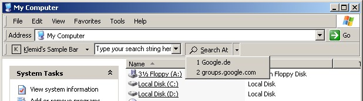



## Internet Explorer Toolbar

### Description

You want to have your own IE toolbar like Google or eBay? Writing Explorer Toolbar with pure VB seems to be one of the last challenges in the VB world. I tried hard and I guess came a step further compared to Eduardo Morcillo's 'Shell Extension' code. The main difficulty is that the CoolBar in the Common Control ActiveX component doesn't support variable-length buttons, which makes it more or less useless for an Explorer toolbar implementation. This forces you to use API calls to create the toolbar. Eduardo's go-ahead was to create the textbox on the toolbar via an API call as well. I wanted to avoid this because this makes it more difficult to handle events and set attributes of the textbox. My code re-uses the textbox from a VB form. Additionally it takes the dropdown menus associated with the two toolbar buttons from the same VB form. Another difficulty was to handle certain accelerator keys like Backspace within the toolbar. I found a simpler solution for this compared to Eduardo's code.

The toolbar has a very simple functionality. I simply wants to show how you can build one with as much VB as possible.

For more recent and more enhanced versions of the toolbar please visit my homepage www.klemid.de.

The VB project makes use of Edanmo's OLELIB.TLB. To avoid a version hell please download the typelib stuff directly from Edanmo's site (http://www.mvps.org/emorcillo/). The typelib is only required when you want to recompile the VB project.

The code was developed under Window XP / IE6. I tested if hasty under W2K/IE5 and Win98 SE/IE5.5 and it worked as well.

Updates:

2004-07-03 Slightly modified AddToolbarButtons
 
### More Info
 
The VB project makes use of Eduardo's OLELIB.TLB. To avoid a version hell please download the typelib stuff directly from Eduardo's site (http://www.mvps.org/emorcillo/). The typelib is only required when you want to recompile the VB project.

The code was developed under Window XP / IE6. I tested if hasty under W2K/IE5 and Win98 SE/IE5.5 and it worked as well.

             |
---                |---
**Submitted On**   |2004-01-25 09:26:22
**By**             |[Klemens Schmid](https://github.com/Planet-Source-Code/PSCIndex/blob/master/ByAuthor/klemens-schmid.md)
**Level**          |Advanced
**User Rating**    |4.6 (148 globes from 32 users)
**Compatibility**  |VB 6\.0
**Category**       |[Internet/ HTML](https://github.com/Planet-Source-Code/PSCIndex/blob/master/ByCategory/internet-html__1-34.md)
**World**          |[Visual Basic](https://github.com/Planet-Source-Code/PSCIndex/blob/master/ByWorld/visual-basic.md)
**Archive File**   |[Internet\_E176529732004\.zip](https://github.com/Planet-Source-Code/klemens-schmid-internet-explorer-toolbar__1-41922/archive/master.zip)

